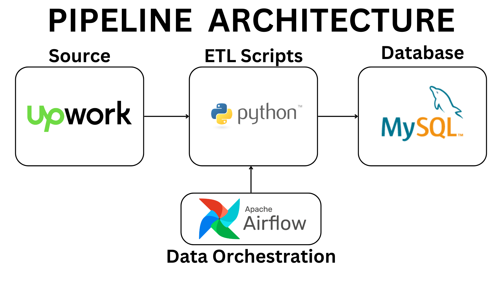

# Upwork ETL Pipeline

## Table of Contents

- [ETL Pipeline Overview](#etl-pipeline-overview)
  - [Extract](#extract)
  - [Transform](#transform)
  - [Load](#load)
  - [DAG Script for Apache Airflow](#dag-script-for-apache-airflow)
- [Opportunities for Improvement](#opportunities-for-improvement)

## ETL Pipeline Overview

This ETL pipeline is an expansion of my previous project [Upwork Job Post Data Analysis](https://github.com/raufh10/Upwork_Job_Data_Analysis), which included an ETL component. I have now developed it into a full ETL pipeline. I'm using Python for extracting, transforming, and loading the data, specifically utilizing BeautifulSoup (bs4) and Playwright for web scraping. For pipeline orchestration, I use Apache Airflow, and for the database, I use MySQL. This project focuses solely on building the pipeline, not on constructing a data warehouse.

Here are picture of pipeline architecture:

The ETL pipeline consists of the following steps:

### Extract

This Python script automates the extraction of data analyst job postings from Upwork. It navigates to specific URLs, retrieves job listings up to a predefined page limit, and extracts details such as job descriptions and features. The extracted data is temporarily stored for further processing. The script uses `BeautifulSoup` for HTML parsing and `playwright.sync_api` for browser automation to efficiently handle web data extraction.

### Transform

This Python script is designed to transform data related to job postings from Upwork. Here's what it does:

- *Transform Skill Categories JSON*: Adjusts skill category data by organizing titles and IDs, removing duplicates, and cleaning up the skill lists from irrelevant entries.
- *Transform Job Data*: Processes job data by organizing job titles and IDs, removing duplicate job entries, cleaning labels and descriptions, and categorizing key job features.
- *Merge Skills and Jobs Data*: Combines the refined skills and job data into one single JSON file for further processing.
- *Flatten Skills*: Flatten skills list to a string format for ingestion into the MySQL database.
- *Clean Up*: Deletes temporary skill category files after processing.

The script focuses on refining and enhancing data quality for better usability in data analysis or further data processing tasks. It uses JSON for data handling and incorporates custom functions to clean and organize the data effectively.

### Load

This Python script is tailored for loading job data into a MySQL database and managing post-load cleanup:

- *Load Data*: Connects to MySQL using credentials, inserted data into the database with prepared SQL statements. Finally commits the transaction and closes the database connection.
- *Cleanup*: Deletes the JSON file after loading data into the database.

The script utilizes `mysql.connector` for database operations and `dotenv` for environment variable management.

### DAG Script for Apache Airflow

You can also find a DAG script for Apache Airflow in the `dags` directory. The script is designed to automate the ETL pipeline by scheduling and orchestrating the execution of the individual scripts. The DAG script defines the sequence of tasks and their dependencies, ensuring the proper execution of the ETL pipeline.

### Setting Up the MySQL Database (Additional Step)

In the `database_script` directory, you can find a SQL script that sets up the MySQL database for the ETL pipeline. The script creates a database, a table for job postings. You can run the script in your MySQL environment to prepare the database for loading data.

## Opportunities for Improvement

There are several opportunities for improvement in the ETL pipeline:

1. **Parallel Pipeline for Monitoring**: Implement a parallel pipeline that runs concurrently with the main pipeline to monitor its performance and measure processing metrics, ensuring real-time tracking and optimization.
2. **Error Handling**: Enhance error handling mechanisms to catch and respond to exceptions more effectively, reducing downtime and ensuring the pipeline's reliability.
3. **Data Validation**: Introduce rigorous data validation checks after each pipeline step to ensure the accuracy and integrity of the data as it moves through the process.
4. **Enhanced Logging for Documentation**: Implement more comprehensive logging strategies that provide detailed documentation of the pipeline’s operation, aiding in debugging and maintaining historical records for analysis.
